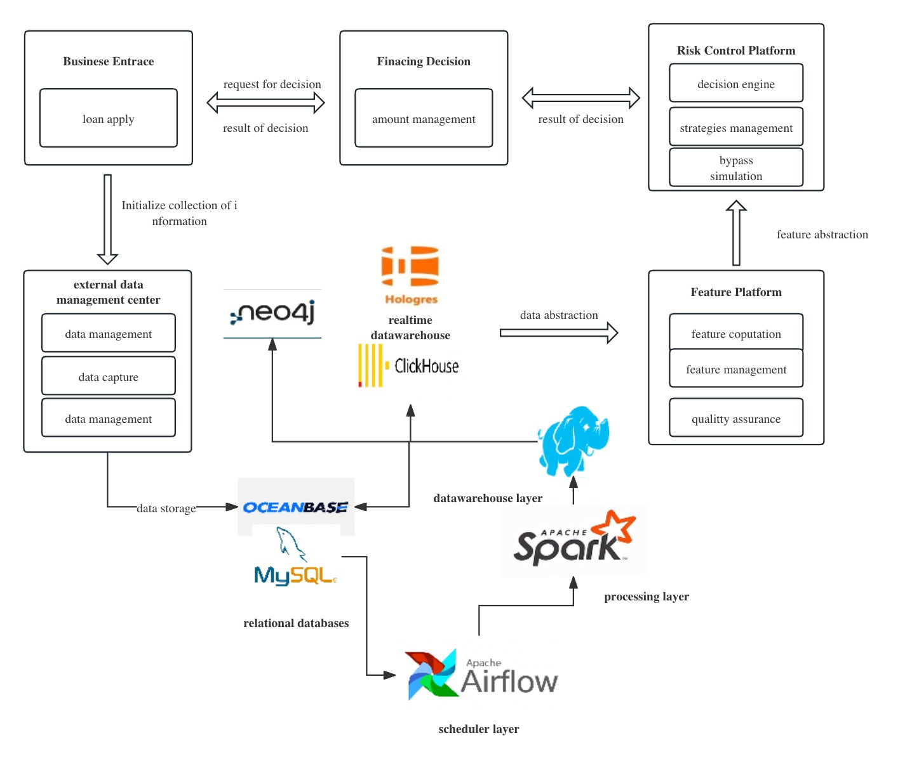

# spark_me
## Introduction
in this project i want to build an decision engine system that really close to what we use in cooperation in daily life.
As a data engineer, first i'm gonna to finish the part of the pipeline of big-data platform.
using each component in different scenarios. among them are:

neo4j : graph database.

clickhouse : speed-up layer

spark : processing layer.

mysql : data source(for data catching system)

some of these components i post the corresponding cloud native components.
the big picture of the whole system shows below:

